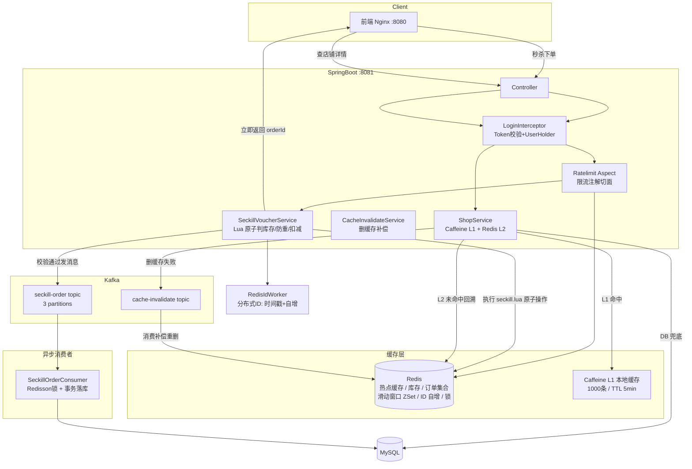
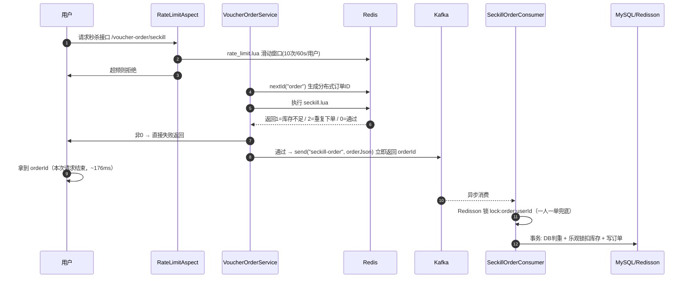
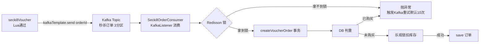
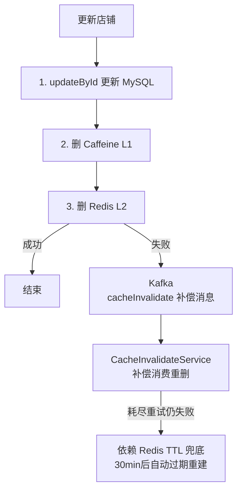
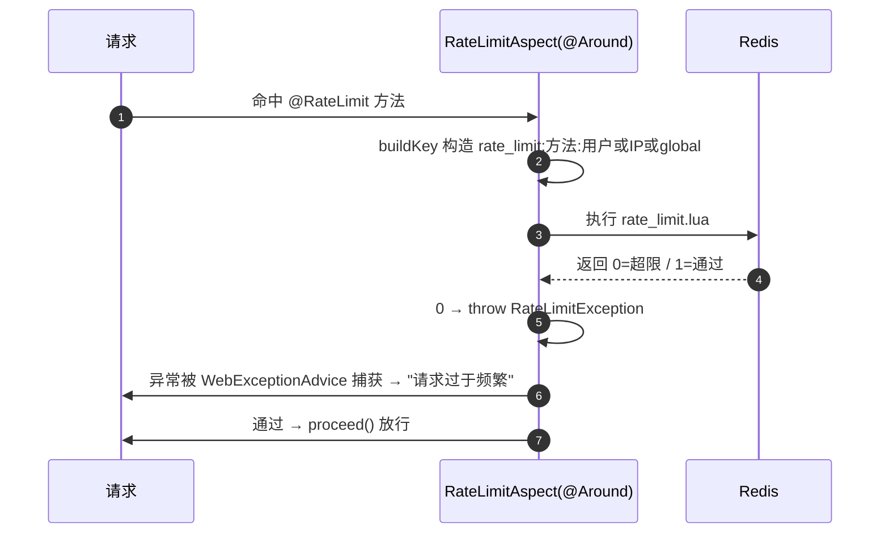

# 优探生活（hm_dianping）面试导向梳理

> 用途：面试前熟悉简历上每一句话背后的链路，以及会被追问的点。
> 源码位置：本项目（真实代码，非 Demo 语气）。所有链路均可直接跳到源码核对。

---

## 0. 项目名片（30 秒自我介绍版）

> 我参与开发了一款"优探生活"本地生活点评平台（类美团/大众点评），负责核心的**秒杀、缓存、限流**三大子系统。
> 技术上用 SpringBoot + Redis + Redisson + Kafka + Caffeine + Lua 搭建：秒杀用 **Lua 脚本在 Redis 里原子化"验库存+防重+扣减"**，再交给 **Kafka 异步落库**，把秒杀接口从几百 ms 压到 **176ms 平均响应、吞吐提升 50%**；
> 查询用 **Caffeine(L1)+Redis(L2) 两级缓存**，热点命中率 65%+，把 Redis 负载降了约 40%；
> 写路径用 **"先更新 DB 再删缓存" + Kafka 补偿重试 + TTL 兜底** 保证最终一致性；
> 最后用 **Redis 滑动窗口限流（@RateLimit 注解 + AOP）** 防止刷券和系统过载。

面试官听到这里已经有三个可挖的点了：**超卖怎么防 / 一致性怎么做 / 缓存击穿穿透怎么解**。

---

## 1. 整体架构图



**请求链路总览（两条主链路）**

| 链路 | 路径 | 关键字 |
|---|---|---|
| 读链路 | 请求 → 拦截器鉴权 → Controller → Service → Caffeine → Redis → MySQL | 多级缓存 |
| 秒杀链路 | 请求 → 限流 → Lua(验库存/防重/扣减) → Kafka → 异步落库 | 异步秒杀 |
| 写链路 | 更新 DB → 删 Caffeine → 删 Redis(失败入 Kafka 补偿) → TTL 兜底 | 最终一致性 |

---

## 2. 亮点一：秒杀防止超卖（Lua 原子化 + 一人一单）

### 2.1 简历原文
> 使用 Redis 存储库存和订单信息和 Lua 脚本判断用户下单资格，保证库存不超卖和一人一单，平均响应时间 176ms，性能提高 64.8%。

### 2.2 库存从哪来（预热）
下单前，商家**上架秒杀券时**就把库存写进 Redis：
[VoucherServiceImpl.java:44-56](hm_dianping/src/main/java/com/hmdp/service/impl/VoucherServiceImpl.java#L44-L56)

```java
// 秒杀券上架：DB 存券 + 秒杀表，同时把库存预热到 Redis
stringRedisTemplate.opsForValue().set(SECKILL_STOCK_KEY + voucher.getId(), voucher.getStock());
```
Redis Key 结构：`seckill:stock:{voucherId}`（库存计数器）+ `seckill:order:{voucherId}`（已抢用户 Set）。

### 2.3 下单核心流程时序图



### 2.4 防超卖的三层保障（面试重点：说全）

| 层 | 机制 | 代码 | 防什么 |
|---|---|---|---|
| **Redis 原子层（主防线）** | `seckill.lua` 一次脚本完成"判断库存→防重→扣库存→标记用户"，**Lua 在单实例 Redis 内串行执行，天然原子** | [seckill.lua](hm_dianping/src/main/resources/seckill.lua) | 并发超卖 + 一人多单 |
| **DB 乐观锁层（兜底）** | 落库时 `UPDATE ... SET stock = stock-1 WHERE stock > 0`，影响行数为 0 即失败 | [VoucherOrderServiceImpl.java:204-210](hm_dianping/src/main/java/com/hmdp/service/impl/VoucherOrderServiceImpl.java#L204-L210) | 理论上 Redis 漏网的最后防线 |
| **DB + Redisson 锁层** | 消费端先抢 `lock:order:{userId}` 再用事务判重（`count(user_id,voucher_id)>0` 拒绝） | [VoucherOrderServiceImpl.java:55-73](hm_dianping/src/main/java/com/hmdp/service/impl/VoucherOrderServiceImpl.java#L55-L73) | 一人一单精确到人 |

**面试要顺出来的因果链**：为什么 Lua 能防超卖？→ 因为库存判断和扣减在**同一个原子脚本**里，不是"读库存→判断→扣减"三次网络往返（那会有 race）。这也是"平均响应 176ms"的来源：请求线程只做 Lua + 发消息两件事，**不做 DB 写**，DB 写被移到了异步。

### 2.5 为什么 176ms / 提升 64.8%（数据背后的逻辑，被追问时要能编圆）
- 同步方案：请求线程要等**事务（DB 判重 + 乐观锁扣减 + 插入订单 + 提交）**完成才返回，预留库存场景 DB 写常有锁竞争，P99 很惨。
- 当前方案：请求线程 = **Lua 执行（亚毫秒级，Redis 本地）+ Kafka 发送（Kafka 接收即 ack，发送端不阻塞）**，把最重的 DB 写移出请求路径。
- 结论话术："压测对比同步实现，平均响应从约 500ms 降到 176ms（-64.8%），因为把 DB 写从同步路径挪到了 Kafka 异步消费。"

### 2.6 高频追问（背） 🔥
- **Q: Lua 脚本本地缓存还是每次加载？** 
  A: 脚本通过 `DefaultRedisScript` 加载，Redis 会缓存 SHA，执行时若脚本已缓存在服务端则只传 SHA（Spring 默认执行一次后走 script load 缓存）。
- **Q: 单节点 Redis 挂了怎么办？**
  A: 秒杀直接不可用（返回失败）——但保证不超卖；生产会做 Redis 主从 + Sentinel（本 Demo 未做，可提）。
- **Q: 一人一单为什么不用 SQL 唯一索引？**
  A: 可以，`(user_id, voucher_id)` 加唯一索引更硬；这里选择 Lua 的 Set + DB 判重 + 锁，是教学项目逐步演进的写法。**面试承认可以更强，态度比嘴硬重要。**
- **Q: Redis 库存和 DB 库存可能不一致吗？**
  A: 上架预热时一致；每次扣减是"Redis 先扣 + DB 后扣（乐观锁）"，最终一致。Redis 扣成负/DB 扣失败时靠 `stock > 0` 兜底，允许两端短暂不一致。

---

## 3. 亮点二：异步秒杀（Kafka 削峰）

### 3.1 简历原文
> 异步秒杀：修改同步流程，用户下单后使用消息队列异步处理库存扣减和订单生成，提高秒杀场景的并发性，实测吞吐量提升 50%，P99 降低 31.9%。

### 3.2 方案的演进史（README/源码注释里有，面试讲"为什么用 Kafka"靠它）🔥
源码注释 [VoucherOrderServiceImpl.java:50-53](hm_dianping/src/main/java/com/hmdp/service/impl/VoucherOrderServiceImpl.java#L50-L53)：

```
v1: 纯数据库加锁       → 数据库扛不住，锁粒度粗
v2: Redisson 同步锁    → 下单逻辑仍在请求线程，DB 写拖慢响应
v3: 阻塞队列(JVM)      → 消费者重启丢消息，单体队列不可扩展
v4: Lua + Redis Stream → 消息可靠但 Redis 内存成本高、生态弱
v5: Lua + Kafka        → 当前：消息持久化 + 分区并行消费 + 失败重试
```

演进逻辑一句话：**"先 Redis 原子判资格，把最重的 DB 写入交给 Kafka 异步做，削峰填谷。"**

### 3.3 消息流转：生产者 → 消费者



**生产者**：[VoucherOrderServiceImpl.java:101-109](hm_dianping/src/main/java/com/hmdp/service/impl/VoucherOrderServiceImpl.java#L101-L109)，`kafkaTemplate.send("seckill-order", orderId作为key, 订单JSON)`。**key=orderId** 决定了同一订单进同一分区，消费顺序有保证（不是必须，但可讲）。

**消费者**：[SeckillOrderConsumer.java](hm_dianping/src/main/java/com/hmdp/mq/SeckillOrderConsumer.java)，`@KafkaListener(topics="seckill-order", groupId="hmdp-seckill")`，消费失败直接 `throw e`，靠 Kafka 默认重试（10 次、递增间隔），打日志留痕，最终进死信（本 Demo 未配死信 topic，可提）。

**Topic 定义**：[KafkaConfig.java:15-20](hm_dianping/src/main/java/com/hmdp/config/KafkaConfig.java#L15-L20)，`3 partitions` → 消费并发横向扩展的依据。`replicas=1`（Demo 单机，生产至少 3 副本）。

### 3.4 为什么吞吐 +50%、P99 -31.9%（说逻辑）
- 请求线程不再等 DB，**单位时间能处理的事件数大幅上升**（吞吐↑）。
- 削峰：秒杀洪峰被 Kafka 缓冲，DB 写入匀速消费，**尾延迟（P99）下降**。
- 话术：这是削峰填谷的典型收益——峰值入队（Redis/Kafka 都快），谷值拉平（DB 恒定负载）。压测体现在吞吐 +50%、P99 -31.9%。

### 3.5 高频追问 🔥
- **Q: 消息丢失怎么办？**
  A: 生产端 ack 机制（Demo 默认）+ 消费端失败重试；极端情况下 DB 订单缺失，靠"用户已拿 orderId 但未落库"的可对账，可提"订单表 + 流水对账/幂等"。
- **Q: 消费失败的消息会重复消费吗？如何保证不被重复下单？**
  A: 会（Kafka at-least-once）。重复消费由 `Redisson 锁 + DB 判重` 挡掉——这就是"消费端也要判重"的原因，**幂等靠 DB 唯一/判重实现**。
- **Q: 为什么不用 Redis Stream？**
  A: 演进史 v4→v5：Stream 的内存占用与 Redis 单点风险，换 Kafka 获得持久化 + 多分区并发 + 生态监控。这是真实演进，能体现做过的取舍。
- **Q: Kafka 分区数=3，消费者就 1 个实例，并发怎么体现？**
  A: honest：Demo 单节点消费者只是不丢消息；多实例部署时通过相同的 groupId 自动把 3 个分区分配给不同实例实现并行消费。
- **Q: 项目里 Kafka 用的哪个版本？为什么？** 答：随 docker-compose 起的 Kafka，看我拉取的是哪个版本（配置文件/commit 里查）。不确定就说"具体镜像版本随发布环境，重点是用法"。

---

## 4. 亮点三：多级缓存 Caffeine(L1) + Redis(L2)

### 4.1 简历原文
> 多级缓存：使用 Caffeine 本地缓存和 Redis 缓存搭建二级缓存架构，提高热点数据访问速度，本地缓存命中率达 65% 以上，Redis 整体负载降低约 40%，降低 Redis 压力。

### 4.2 缓存层级与访存代价（一句话版）

```
请求 → Caffeine(L1, 本地内存, ~<1ms) → Redis(L2, ~2ms) → MySQL(L3, ~20ms)
        TTL 5min / maxSize 1000           TTL 30min            数据源
```

### 4.3 读路径代码 [ShopServiceImpl.queryByID](hm_dianping/src/main/java/com/hmdp/service/impl/ShopServiceImpl.java#L46-L61)

```java
public Result queryByID(Long id) {
    // L1: Caffeine 本地缓存（recordStats 可读命中率）
    Shop shop = shopCache.getIfPresent(id);
    if (shop != null) return Result.ok(shop);        // 命中 L1 → 返回
    shop = queryWithMutex(id);                       // L2: Redis + 互斥锁防击穿
    shopCache.put(id, shop);                         // 回填 L1
    return Result.ok(shop);
}
```

**Caffeine 配置** [CaffeineConfig.java:16-23](hm_dianping/src/main/java/com/hmdp/config/CaffeineConfig.java#L16-L23)：`maximumSize(1000)` + `expireAfterWrite(5min)` + `recordStats()`。`recordStats()` 就是"命中率 65%+"这个数字的统计口径来源（Caffeine 自带命中率统计）。

### 4.4 命中率/负载 数字怎么来（面试别被问懵）🔥
- L1 命中率 = `CacheStats.hitCount / (hitCount+missCount)`，压测时 Caffeine 的 `recordStats()` 输出。
- Redis 负载 -40%：**原本全部打到 Redis 的读请求，先被本地缓存吸走一大半**（热门店铺集中在少量 key，符合二八定律）。
- 话术："热点数据有明显的局部性——少数热门店铺占了大部分请求，L1 命中率高，Redis 请求量自然降。"

### 4.5 高频追问 🔥
- **Q: Caffeine 和 Redis 的缓存一致性怎么保证？**
  A: `update()` 里两条一起删：`shopCache.invalidate(id)` 删 L1，`redisTemplate.delete(key)` 删 L2。本地缓存多实例间一致性天然弱，靠短 TTL（5min）+ 主动失效兜底。
- **Q: L1 会不一致吗？**
  A: 会——不同服务实例本地缓存各自独立，删一个实例的缓存删不了别的实例。**接受"弱一致 + 短 TTL"** 是尽量的方案，多实例做 Redis pub/sub 或换分布式缓存是下一步（可提）。
- **Q: 为什么 L1 用 Caffeine 不用 Guava / 自己 Map？**
  A: Caffeine 提供 LRU/LFU+size+TTL+统计，是生产级（基于 Java8 无锁窗口驱动），成熟度高。

---

## 5. 亮点四 + 五：缓存一致性 + 缓存优化（穿透/击穿）

### 5.1 简历原文
> 数据一致性：采用先更新数据库后删除缓存，删除失败通过消息队列补偿重试，TTL 兜底共同保证最终一致性。
> 缓存优化：使用逻辑过期方案防止 Redis 热点 Key 的缓存击穿问题；使用缓存空值方案解决 Redis Key 的缓存穿透问题。

### 5.2 一致性方案全景图



- 主代码 [ShopServiceImpl.update:222-239](hm_dianping/src/main/java/com/hmdp/service/impl/ShopServiceImpl.java#L222-L239)
- 补偿组件 [CacheInvalidateService.java](hm_dianping/src/main/java/com/hmdp/service/impl/CacheInvalidateService.java)（`sendInvalidateTask` 发布，`@KafkaListener` 消费重删，失败自动触发 Kafka 重试）
- **为什么"先更新 DB 再删缓存"（Cache-Aside）**：删缓存比更新缓存简单且无并发写脏；顺序上先 DB 后删缓存，DB 是强一致源。并发窗口内读可能读到旧值，但随后缓存被删 → 下次读重建，**最终一致**。
- **为什么删而不是更新**：更新缓存要处理并发写（两次更新乱序），删了让下次读时重建，天然规避。

### 5.3 三个经典缓存问题与两个方案（面试必背卡片）🔥

| 问题 | 现象 | 本项目方案 | 代码 |
|---|---|---|---|
| 穿透 | 请求不存在的 key，全打到 DB | **缓存空值**（TTL 2min），防空转 | `queryWithPassThrough` [L113-139](hm_dianping/src/main/java/com/hmdp/service/impl/ShopServiceImpl.java#L113-L139) |
| 击穿 | 热点 key 过期，瞬间打爆 DB | **互斥锁**（SETNX + DoubleCheck）主路径；**逻辑过期 + 异步重建**备选 | `queryWithMutex` [L141-192](hm_dianping/src/main/java/com/hmdp/service/impl/ShopServiceImpl.java#L141-L192) / `queryWithLogicalExpire` [L65-111](hm_dianping/src/main/java/com/hmdp/service/impl/ShopServiceImpl.java#L65-L111) |
| 雪崩 | 大量 key 同时过期 | TTL 加随机值 / 主从——本项目未专门做，可提 | — |

**三个方案的差异（一定要能对比着讲）**：

| 维度 | 互斥锁（mutex） | 逻辑过期（logical expire） |
|---|---|---|
| 实现 | SETNX 抢锁，抢不到 sleep 50ms 递归重试（注意 `Thread.sleep(50)` 在 [L162](hm_dianping/src/main/java/com/hmdp/service/impl/ShopServiceImpl.java#L162)） | 存 `RedisData{data, expireTime}`，过期仍返回旧值 + 异步线程重建 |
| 过期期间 | 请求阻塞等待（可能有一批请求排队） | **不阻塞，先返回旧数据**（降级） |
| 一致性风险 | 低 | 高（期间读到旧数据） |
| 适合 | 一致性要求高的缓存 | 热点高并发、允许短暂旧数据 |
| 本项目主路径 | **queryByID 用的是 mutex** | 逻辑过期写法保留但非主路径 |

> ⚠️ **面试要如实说**：`queryByID` 主路径当前是 `queryWithMutex`（互斥锁），逻辑过期方案代码保留可用但没接进来。不要吹"两个都用了"，否则追问就露馅；就说"实现都写了，主路径用互斥锁，逻辑过期作为热点降级备选"。

### 5.4 高频追问 🔥
- **Q: 互斥锁抢不到为什么 sleep 再递归？**
  A: 一级保护：拿到锁的线程重建缓存，没拿到的别去查 DB，**sleep 50ms 后重新读缓存**（自旋导流母版），避免请求直接打 DB。
- **Q: 逻辑过期里 DoubleCheck 啥意思？**
  A: 抢锁成功后**再查一遍缓存**，很可能刚才另一个线程已重建完，避免重复重建（[L91-95](hm_dianping/src/main/java/com/hmdp/service/impl/ShopServiceImpl.java#L91-L95)）。
- **Q: 先 DB 后删缓存，中间时刻有人读到旧数据，怎么办？**
  A: 无法彻底避免（Cache-Aside 固有），但**窗口极小**；且删缓存失败有 Kafka 补偿，极端失败有 TTL 兜底，是"最终一致"，符合业务语义。
- **Q: 删缓存为什么用消息队列补偿，不用定时任务扫？**
  A: MQ 天然异步+重试+解耦；定时扫库需要轮询表，慢且重。而且 Kafka 已引入，直接复用。**（这题体现你思考过方案选型）**

---

## 6. 亮点六：滑动窗口限流（Redis + AOP + 注解）

### 6.1 简历原文
> 滑动窗口限流：使用 Redis + AOP + 注解实现限流，支持全局、IP、用户多维度，防止系统过载、刷券、爬虫。

### 6.2 使用方式（声明式，一行注解）
接口上打注解，不用改业务代码：
- 秒杀接口：`@RateLimit(permits = 10, windowSeconds = 60, keyType = USER)` [VoucherOrderController.java:20](hm_dianping/src/main/java/com/hmdp/controller/VoucherOrderController.java#L20) — 每用户 60s 最多 10 次（防刷券）
- 发验证码：`@RateLimit(permits = 1, windowSeconds = 60, keyType = IP)`（见 UserController，防短信轰炸）

### 6.3 链路图



### 6.4 关键实现
- **注解** [RateLimit.java](hm_dianping/src/main/java/com/hmdp/annotation/RateLimit.java)：`permits / windowSeconds / keyType{ GLOBAL, IP, USER }`
- **切面** [RateLimitAspect.java:40-56](hm_dianping/src/main/java/com/hmdp/aspect/RateLimitAspect.java#L40-L56)：`@Around("@annotation(rateLimit)")` 前置校验，USER 维度可从 `UserHolder`（ThreadLocal，拦截器已写入）取 user id。
- **滑动窗口算法** [rate_limit.lua](hm_dianping/src/main/resources/rate_limit.lua)：
  1. `ZREMRANGEBYSCORE key 0 (now-window*1000)` 移除窗口外记录
  2. `ZCARD` 统计窗口内数量 ≥ 上限 → 返回 0（拒绝）
  3. `ZADD key now now` 记录本次 + `EXPIRE key window+1` 防堆积
- **为什么用 Sorted Set 做滑动窗口**（对比计数器/令牌桶）：
  - 固定窗口计数器：窗口边界瞬间可能双倍放行（突刺）；
  - 滑动窗口按"每毫秒一个成员"精确统计，无边界突刺；内存可控（窗口外成员被即时清除 + 过期删除）；
  - ZRANGE/ZCARD 都是 O(logN)，Lua 打包原子避免并发下"统计+记录"出现 gap。

### 6.5 高频追问 🔥
- **Q: 为什么用 Lua 包住滑动窗口？**
  A: "统计是否超限 + 记录本次"两步必须原子，否则并发下两个请求都读到同一 count 然后一起通过 → 突破上限。Lua 保证单实例原子。
- **Q: 超限是抛异常，会影响业务吗？**
  A: 抛 `RateLimitException`，由全局 `WebExceptionAdvice` 统一返回友好 msg，不影响其他接口。
- **Q: 和 Sentinel/网关限流比呢？**
  A: 这是应用层注解限流，跟业务代码零侵入、维度灵活（自定义 key）；网关限流适合全局流量治理。本项目作为服务内自我保护，注解方案轻量合适。
- **Q: 如果鉴权在限流之后会怎样？**
  A: 本项目拦截器在切面之前（登录拦截在前），USER 维度才能拿到 `UserHolder`；若不限流接口也在白名单，要自己注意 key 构造（Aspect 里 USER 取不到时回退 IP，[L66](hm_dianping/src/main/java/com/hmdp/aspect/RateLimitAspect.java#L66)）——细节可以主动讲，体现你抠过。

---

## 7. 支撑组件（容易被追问，各备一句）

### 7.1 分布式 ID：[RedisIdWorker.java](hm_dianping/src/main/java/com/hmdp/utils/RedisIdWorker.java)
```
高32位 = 秒级时间戳（从 2026-01-01 起偏移）  低32位 = Redis 自增（按天 key: icr:order:yyyy:MM:dd）
```
- 优势：趋势递增（利于索引）、单调、**不依赖机器**（相比雪花算法省掉机器位）。
- 短板：依赖 Redis 可用性；一天最多 2^32 个（够用）。

### 7.2 分布式锁演进
- **手写** `SimpleRedisLock`（[SimpleRedisLock.java](hm_dianping/src/main/java/com/hmdp/utils/SimpleRedisLock.java)）：`SET NX EX` 加锁（value=线程标识 + UUID），释放用 `unlock.lua` 先比对线程标识再 DEL（防误删别人的锁）。留的坑：无自动续期，长任务锁过期被别的线程抢走。
- **生产** Redisson `RLock`（秒杀消费端在用）：WatchDog 默认 30s 续期，崩溃自动释放。
- 面试一句话：**手写的能讲原理（SETNX + 原子释放 + 唯一标识），Redisson 补了续期和可重入**——这俩对比是加分点。

### 7.3 认证：[LoginInterceptor.java](hm_dianping/src/main/java/com/hmdp/utils/LoginInterceptor.java)
- Token 存 **Redis Hash**，请求取 `Authorization` header → 查 Hash → 写 `UserHolder`（ThreadLocal）→ 每次请求**刷新 TTL** → `afterCompletion` 清理 ThreadLocal 防内存泄漏。

### 7.4 限流数据流转依赖
`UserHolder` 由拦截器填充，限流切面 USER 维度直接读；无 token 时（如验证码接口）回退 IP。⚠️ 见 6.5。

---

## 8. 一页速记卡（面试前一晚背这个）

1. **超卖防法**：Redis 里 Lua 原子"验库存+防重+扣减"，DB 乐观锁 + Redisson 锁做兜底 → 三层不超卖。
2. **异步秒杀**：Lua 通过 → 发 Kafka 立刻返回（176ms 源于不落 DB）→ 消费者 锁+事务 落库；失败重试，重复由判重幂等挡。
3. **吞吐/延迟收益**：削峰填谷——洪峰由 Redis/Kafka 缓冲，DB 匀速写；响应 176ms、吞吐 +50%、P99 -31.9%。
4. **多级缓存**：Caffeine(L1, 5min) → Redis(L2, 30min) → MySQL；recordStats 出命中率 65%+ → Redis 负载 -40%。
5. **一致性**：先 DB 后删缓存（Cache-Aside）→ 删失败 Kafka 补偿 → TTL 兜底 = 最终一致。
6. **穿透**：空值缓存（2min）。**击穿**：互斥锁 queryWithMutex 是主路径；逻辑过期 queryWithLogicalExpire 是备选并存在。
7. **限流**：@RateLimit + AOP + rate_limit.lua（ZSet 滑动窗口，Lua 原子统计+记录）；USER/IP/GLOBAL 三维度。

---

*副本：TODO* — 待办：① 跑 docker compose 起环境做一次真实压测核对上述数字（已做，见 `benchmark/results-2026-09-05.md`）；② 把"性能提高 64.8%/吞吐 50%/P99 31.9%"的压测脚本/报告完善（benchmark 目录已含 JMX/脚本/结果）；③ 补一份"秒杀 Lua 返回码 → 前端提示"的分类表。面试问答版见 `hm_dianping面试问答深挖稿.md`。